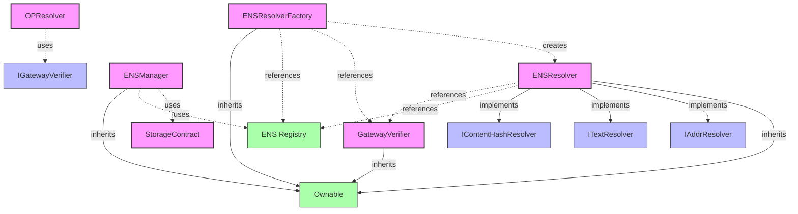

# ENS Resolver Factory System Architecture

This document outlines the architecture and relationships between the contracts in the ENS Resolver Factory system.

## Contract Relationships

## Components Description

### ENSResolverFactory

A factory contract that creates and manages ENS Resolver instances. Users can create their own resolver instances with custom configuration.

- **Source**: Newly created for this project
- **Purpose**: Simplifies the creation and management of ENS Resolvers
- **Key Features**:
  - Create resolver instances with ownership transfer to creator
  - Track created resolvers globally and per user
  - Update ENS registry and GatewayVerifier references

### ENSResolver

An ENS Resolver that implements standard ENS resolution interfaces and integrates with the Gateway Verifier for authority verification.

- **Source**: Adapted from ENS standard resolvers with GatewayVerifier integration
- **Purpose**: Resolve ENS names to addresses and other data types
- **Key Features**:
  - Implements standard ENS resolution interfaces
  - Integrates with Gateway Verifier for authority checks
  - Supports multi-chain address resolution

### GatewayVerifier

A contract that verifies gateways and DNS zones, used for authority verification in the ENS resolution process.

- **Source**: Created for this project
- **Purpose**: Provide a trust layer for gateway verification
- **Key Features**:
  - Verify gateways and DNS zones
  - Associate DNS zones with gateways
  - Provide verification checks for ENSResolver

### ENS Registry

The standard ENS Registry contract that maintains the ownership and resolver information for ENS names.

- **Source**: External dependency from ENS
- **Purpose**: Core ENS name registry

### ENSManager & StorageContract

Part of the existing L2 resolution system:
- **ENSManager**: Manages ENS domains on L2
- **StorageContract**: Stores resolution data on L2

### OPResolver

Implements EIP-3668 CCIP Read protocol to retrieve ENS resolution data from Optimism L2.

- **Source**: Part of the existing L2 resolution system
- **Purpose**: Bridge between L1 and L2 for ENS resolution

## Necessity and Benefits

The ENSResolverFactory system provides several key benefits:

1. **Simplicity**: Simplifies the creation and management of ENS resolvers
2. **Modularity**: Allows users to create their own resolver instances
3. **Standardization**: Follows ENS standards while adding custom functionality
4. **Ownership**: Transfers ownership of created resolvers to their creators
5. **Tracking**: Maintains lists of created resolvers for discovery and management

This system exists to make it easier for users to deploy and manage their own ENS resolvers, while integrating with the existing unruggable gateways infrastructure for cross-chain ENS name resolution. 