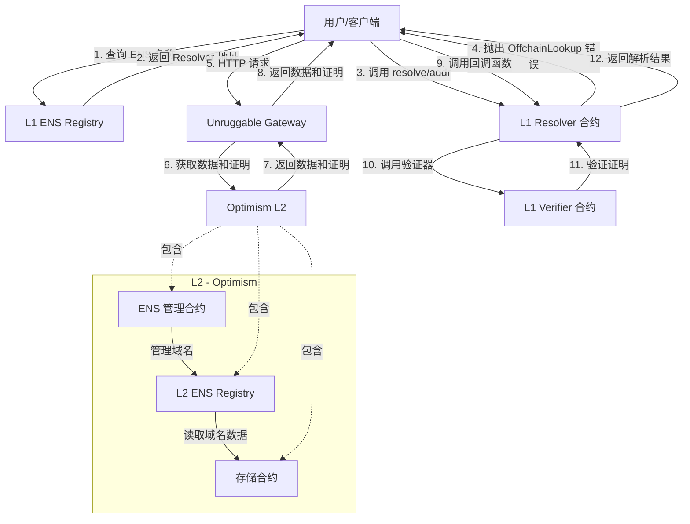

# ENS Layer 2 解析系统部署方案

本文档提供了基于 Unruggable Gateways 实现 ENS Layer 2 (Optimism) 域名解析系统的完整部署方案。

## 系统架构



## 需要部署的合约

### L2 (Optimism) 合约

1. **ENS Registry**
   - 目的：存储域名层级结构
   - 源码：https://github.com/ensdomains/ens-contracts/blob/master/contracts/registry/ENSRegistry.sol

2. **存储合约**
   - 目的：存储域名解析数据
   - 源码：需要根据 OPResolver.sol 中引用的 STORAGE_CONTRACT_ADDRESS 合约接口实现

3. **ENS Manager**
   - 目的：管理域名注册和子域名
   - 源码：https://github.com/ensdomains/ens-contracts/blob/master/contracts/registry/ENSRegistryWithFallback.sol (可修改适配)

### L1 (以太坊主网) 合约

1. **OPFaultVerifier**
   - 目的：验证从 Optimism 获取的数据证明
   - 源码：本仓库中的引用 `@unruggable/contracts/op/OPFaultVerifier.sol`

2. **OPResolver**
   - 目的：实现 CCIP Read 协议，连接到 Gateway
   - 源码：本仓库的 `contracts/OPResolver.sol`

## 前端代码实现

推荐使用以下开源项目作为前端实现的参考：

1. **ENS App**
   - 官方 ENS 管理应用
   - 源码：https://github.com/ensdomains/ens-app-v3

2. **ENS Offchain Registrar**
   - 提供离链解析的参考实现
   - 源码：https://github.com/gskril/ens-offchain-registrar

3. **ethers.js 库**
   - 用于处理 ENS 解析和 CCIP Read 协议
   - 文档：https://docs.ethers.org/v5/api/providers/provider/#Provider-resolveName

## 部署步骤

### 1. 环境准备

```bash
# 克隆仓库
git clone https://github.com/unruggable-labs/unruggable-gateways-ens-resolution-demos.git
cd unruggable-gateways-ens-resolution-demos

# 安装依赖
curl -fsSL https://bun.sh/install | bash
bun install
forge install

# 配置环境变量
cp .env.example .env
# 编辑 .env 添加以太坊和 Optimism 节点的 API keys
```

### 2. L2 (Optimism) 合约部署

以下是使用 Forge 部署 L2 合约的脚本示例：

```solidity
// SPDX-License-Identifier: MIT
pragma solidity ^0.8.25;

import "forge-std/Script.sol";
import "@ensdomains/ens-contracts/contracts/registry/ENSRegistry.sol";
import "./StorageContract.sol"; // 实现的存储合约
import "./ENSManager.sol"; // 实现的管理合约

contract DeployL2Contracts is Script {
    function run() external {
        uint256 deployerPrivateKey = vm.envUint("PRIVATE_KEY");
        vm.startBroadcast(deployerPrivateKey);

        // 部署 ENS Registry
        ENSRegistry registry = new ENSRegistry();
        console.log("ENS Registry deployed at:", address(registry));

        // 部署存储合约
        StorageContract storage = new StorageContract();
        console.log("Storage Contract deployed at:", address(storage));

        // 部署管理合约
        ENSManager manager = new ENSManager(address(registry));
        console.log("ENS Manager deployed at:", address(manager));

        // 设置 ENS 根域名的所有者为管理合约
        bytes32 rootNode = 0x0000000000000000000000000000000000000000000000000000000000000000;
        registry.setOwner(rootNode, address(manager));

        vm.stopBroadcast();
    }
}
```

部署命令：

```bash
# 编译合约
forge build

# 部署到 Optimism 测试网
forge script script/DeployL2Contracts.s.sol --rpc-url $OPTIMISM_RPC_URL --broadcast --verify
```

### 3. L1 (以太坊主网) 合约部署

以下是使用 Forge 部署 L1 合约的脚本示例：

```solidity
// SPDX-License-Identifier: MIT
pragma solidity ^0.8.25;

import "forge-std/Script.sol";
import "@unruggable/contracts/op/OPFaultVerifier.sol";
import "@unruggable/contracts/GatewayVM.sol";
import "../contracts/OPResolver.sol";

contract DeployL1Contracts is Script {
    function run() external {
        uint256 deployerPrivateKey = vm.envUint("PRIVATE_KEY");
        vm.startBroadcast(deployerPrivateKey);

        // 部署 GatewayVM 库
        GatewayVM gatewayVM = new GatewayVM();
        console.log("GatewayVM deployed at:", address(gatewayVM));

        // 获取 rollup 配置
        address optimismPortal = 0x0000000000000000000000000000000000000000; // 替换为实际地址
        address gameFinder = 0x0000000000000000000000000000000000000000; // 替换为实际地址
        uint256 gameTypeBitMask = 1; // 替换为实际值
        uint256 minAgeSec = 3600; // 替换为实际值

        // 部署 EthVerifierHooks
        address hooks = 0x0000000000000000000000000000000000000000; // 替换为实际地址

        // 部署 OPFaultVerifier
        string[] memory gatewayUrls = new string[](1);
        gatewayUrls[0] = "https://optimism.gateway.unruggable.com";

        uint256 defaultWindow = 1000000; // 替换为实际值

        OPFaultVerifier verifier = new OPFaultVerifier(
            gatewayUrls,
            defaultWindow,
            hooks,
            optimismPortal,
            gameFinder,
            gameTypeBitMask,
            minAgeSec
        );
        console.log("OPFaultVerifier deployed at:", address(verifier));

        // 部署 OPResolver
        OPResolver resolver = new OPResolver(IGatewayVerifier(address(verifier)));
        console.log("OPResolver deployed at:", address(resolver));

        vm.stopBroadcast();
    }
}
```

部署命令：

```bash
# 编译合约
forge build

# 部署到以太坊测试网
forge script script/DeployL1Contracts.s.sol --rpc-url $ETHEREUM_RPC_URL --broadcast --verify
```

### 4. 配置 ENS Resolver

部署完成后，需要将域名的 Resolver 设置为已部署的 OPResolver。以下是示例脚本：

```solidity
// SPDX-License-Identifier: MIT
pragma solidity ^0.8.25;

import "forge-std/Script.sol";
import "@ensdomains/ens-contracts/contracts/registry/ENSRegistry.sol";

contract SetupResolver is Script {
    function run() external {
        uint256 ownerPrivateKey = vm.envUint("PRIVATE_KEY");
        vm.startBroadcast(ownerPrivateKey);

        // 以太坊主网 ENS Registry 地址
        address ensRegistry = 0x00000000000C2E074eC69A0dFb2997BA6C7d2e1e;
        
        // 已部署的 OPResolver 地址
        address opResolver = 0x0000000000000000000000000000000000000000; // 替换为实际地址
        
        // 要设置 Resolver 的域名
        bytes32 node = 0x0000000000000000000000000000000000000000000000000000000000000000; // 替换为实际域名的 namehash
        
        // 设置 Resolver
        ENSRegistry(ensRegistry).setResolver(node, opResolver);
        console.log("Resolver set for node:", vm.toString(node));

        vm.stopBroadcast();
    }
}
```

执行命令：

```bash
forge script script/SetupResolver.s.sol --rpc-url $ETHEREUM_RPC_URL --broadcast
```

### 5. 部署 Gateway 服务

克隆和部署 Unruggable Gateway：

```bash
# 克隆 Gateway 仓库
git clone https://github.com/unruggable-labs/unruggable-gateways.git
cd unruggable-gateways

# 安装依赖
npm install

# 配置 Gateway
# 编辑 config.js 配置 Optimism 节点和其他参数

# 启动 Gateway
npm start
```

确保 Gateway 是公开可访问的，可以使用云服务如 AWS, Google Cloud, 或 Digital Ocean 部署。

## 测试方案

### 1. 本地测试

使用本仓库中的示例脚本进行本地测试：

```bash
# 使用 Foundry fork 进行本地测试
bun run optimism.ts
```

### 2. 端到端测试

创建以下测试脚本，测试完整的解析流程：

```typescript
// test-resolution.ts
import { ethers } from 'ethers';

async function testResolution() {
  // 连接到以太坊主网
  const provider = new ethers.JsonRpcProvider('YOUR_ETHEREUM_RPC_URL');
  
  // 要测试的 ENS 名称
  const ensName = 'your-test-name.eth';
  
  try {
    // 尝试解析 ENS 名称
    console.log(`Resolving ${ensName}...`);
    const address = await provider.resolveName(ensName);
    
    console.log(`Resolution successful! Address: ${address}`);
  } catch (error) {
    console.error('Resolution failed:', error);
  }
}

testResolution().catch(console.error);
```

执行测试：

```bash
bun run test-resolution.ts
```

### 3. 合约单元测试

创建以下 Forge 测试文件测试 Resolver 合约：

```solidity
// SPDX-License-Identifier: MIT
pragma solidity ^0.8.25;

import "forge-std/Test.sol";
import "../contracts/OPResolver.sol";
import "@unruggable/contracts/mocks/MockVerifier.sol";

contract OPResolverTest is Test {
    OPResolver resolver;
    MockVerifier verifier;
    
    function setUp() public {
        // 部署 mock verifier
        verifier = new MockVerifier();
        
        // 部署 resolver
        resolver = new OPResolver(IGatewayVerifier(address(verifier)));
    }
    
    function testSupportsInterface() public {
        // 测试 resolver 是否支持正确的接口
        bytes4 interfaceId = type(IExtendedResolver).interfaceId;
        assertTrue(resolver.supportsInterface(interfaceId));
    }
    
    function testResolve() public {
        // 准备测试数据
        bytes memory name = bytes("unruggable.eth");
        bytes memory data = abi.encodeWithSelector(IAddrResolver.addr.selector, bytes32(0));
        
        // 预设 mock 验证器的返回值
        bytes[] memory results = new bytes[](3);
        results[0] = bytes("registry");
        results[1] = bytes("resolver");
        results[2] = abi.encodePacked(address(0x1234567890123456789012345678901234567890));
        verifier.setResults(results);
        
        // 调用 resolve 函数
        bytes memory result = resolver.resolve(name, data);
        
        // 验证结果
        address resolved = abi.decode(result, (address));
        assertEq(resolved, address(0x1234567890123456789012345678901234567890));
    }
}
```

执行测试：

```bash
forge test
```

## 链上交互脚本

以下脚本展示如何与已部署的系统进行交互：

```typescript
// interact.ts
import { ethers } from 'ethers';

// ENS Registry ABI
const ENS_REGISTRY_ABI = [
  'function resolver(bytes32 node) view returns (address)',
  'function owner(bytes32 node) view returns (address)',
  'function setResolver(bytes32 node, address resolver)',
  'function setOwner(bytes32 node, address owner)'
];

// 连接到以太坊主网
const provider = new ethers.JsonRpcProvider('YOUR_ETHEREUM_RPC_URL');
const wallet = new ethers.Wallet('YOUR_PRIVATE_KEY', provider);

// ENS Registry 地址
const ENS_REGISTRY_ADDRESS = '0x00000000000C2E074eC69A0dFb2997BA6C7d2e1e';
const registry = new ethers.Contract(ENS_REGISTRY_ADDRESS, ENS_REGISTRY_ABI, wallet);

// 域名 namehash
const namehash = ethers.namehash('your-domain.eth');

async function setResolver() {
  // 你部署的 Resolver 地址
  const resolverAddress = 'YOUR_RESOLVER_ADDRESS';
  
  // 设置 Resolver
  const tx = await registry.setResolver(namehash, resolverAddress);
  await tx.wait();
  console.log(`Resolver set to ${resolverAddress} for domain`);
}

async function checkResolution() {
  // 检查是否能解析
  const address = await provider.resolveName('your-domain.eth');
  console.log(`Resolved address: ${address}`);
}

// 运行脚本
async function main() {
  await setResolver();
  await checkResolution();
}

main().catch(console.error);
```

## 注意事项与潜在问题

1. **Gas 费用**：在以太坊主网部署和设置会产生 gas 费用，请确保有足够的 ETH。

2. **权限问题**：需要确保部署者拥有 ENS 域名的所有权，才能设置 Resolver。

3. **Gateway 服务可用性**：Gateway 服务需要高可用性，建议使用云服务和监控系统。

4. **合约升级**：考虑使用代理合约模式，以便将来可以升级 Resolver 和 Verifier 合约。

5. **安全审计**：建议在部署到生产环境之前进行安全审计。

6. **L2 Gas Token**：在 Optimism 上部署需要 OP 代币支付 gas 费用。

7. **跨链风险**：当 Optimism 出现问题时，解析可能会受到影响，请考虑应急机制。

## 额外资源

- **ENS 文档**：https://docs.ens.domains/
- **CCIP Read 规范**：https://eips.ethereum.org/EIPS/eip-3668
- **Optimism 文档**：https://community.optimism.io/docs/
- **Unruggable Gateways 仓库**：https://github.com/unruggable-labs/unruggable-gateways
- **ENS GitHub**：https://github.com/ensdomains 