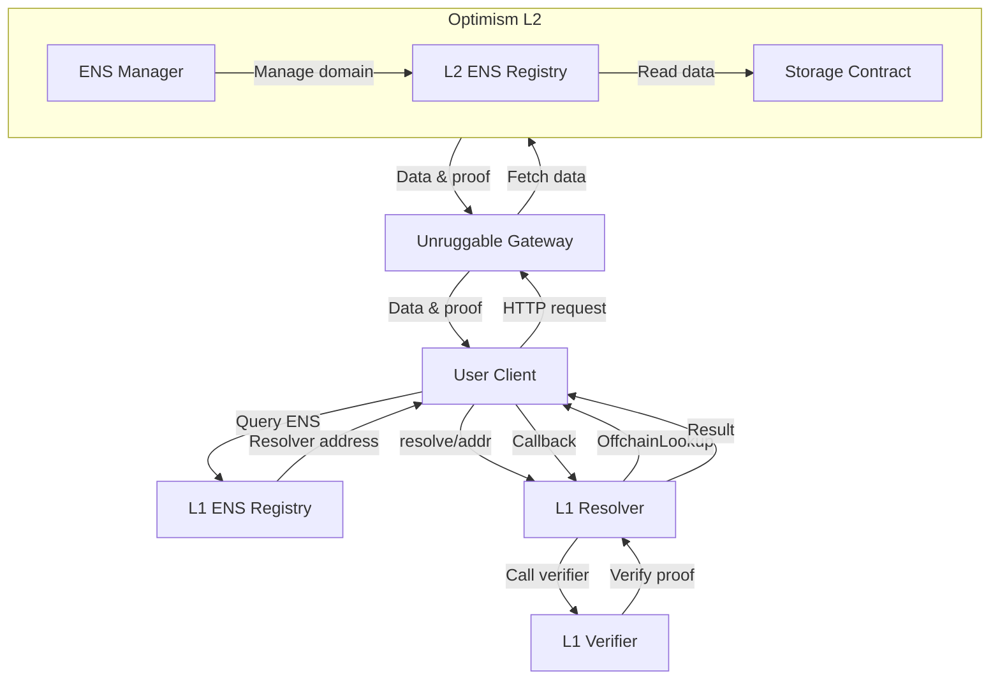
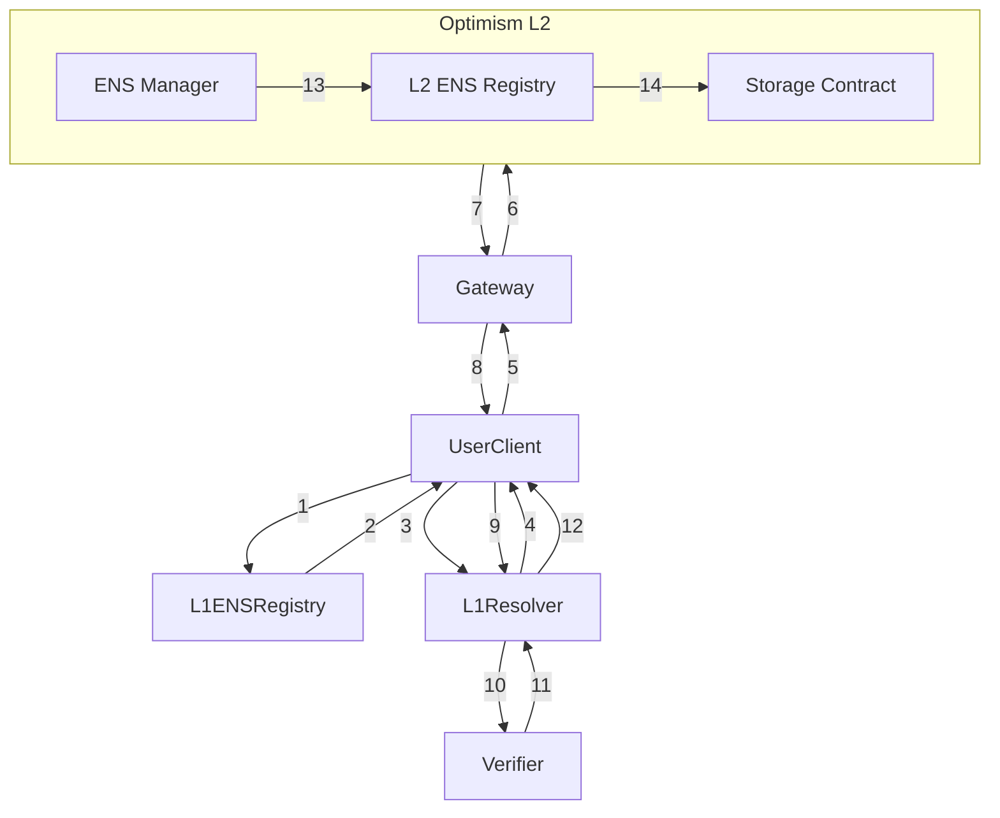

# ENS Layer 2 解析系统部署方案

本文档提供了基于 Unruggable Gateways 实现 ENS Layer 2 (Optimism) 域名解析系统的完整部署方案。

## 系统架构



sequence version



## 需要部署的合约

### L2 (Optimism) 合约

#### 1. **ENS Registry**
   - **目的**：存储域名层级结构
   - **源码**：https://github.com/ensdomains/ens-contracts/blob/master/contracts/registry/ENSRegistry.sol
   - **部署方式**：可以直接使用 ENS 原始合约，无需修改
   - **具体脚本路径**：`script/DeployENSRegistry.s.sol`

#### 2. **存储合约**
   - **目的**：存储域名解析数据
   - **源码**：需要根据 OPResolver.sol 中引用的 STORAGE_CONTRACT_ADDRESS 合约接口实现
   - **开发**：根据下方提供的实现示例开发
   - **具体脚本路径**：`script/DeployStorageContract.s.sol`

#### 3. **ENS Manager**
   - **目的**：管理域名注册和子域名
   - **源码**：基于 https://github.com/ensdomains/ens-contracts/blob/master/contracts/registry/ENSRegistryWithFallback.sol 修改
   - **开发**：需要扩展原始合约以实现所有优先级功能
   - **具体脚本路径**：`script/DeployENSManager.s.sol`
   - **功能实现**：详见下方功能实现部分

### L1 (以太坊主网) 合约

#### 1. **OPFaultVerifier**
   - **目的**：验证从 Optimism 获取的数据证明
   - **源码**：`@unruggable/contracts/op/OPFaultVerifier.sol`
   - **开发**：无需开发，直接使用 Unruggable Gateways 提供的合约
   - **具体脚本路径**：`script/DeployOPFaultVerifier.s.sol`

#### 2. **OPResolver**
   - **目的**：实现 CCIP Read 协议，连接到 Gateway
   - **源码**：`contracts/OPResolver.sol`
   - **开发**：无需修改，直接使用仓库提供的合约
   - **具体脚本路径**：`script/DeployOPResolver.s.sol`

## 开发部分

### 1. 创建存储合约 (StorageContract.sol)

在仓库根目录下创建 `contracts/StorageContract.sol`：

```solidity
// SPDX-License-Identifier: MIT
pragma solidity ^0.8.25;

// 基于 OPResolver.sol 中引用的接口需求实现
contract StorageContract {
    // ENS节点到解析器的映射
    mapping(address => mapping(bytes32 => address)) public registries;
    
    // 存储域名解析数据
    mapping(bytes32 => address) public resolvedAddresses;
    
    // 存储文本记录
    mapping(bytes32 => mapping(string => string)) public textRecords;
    
    // 存储内容哈希
    mapping(bytes32 => bytes) public contentHashes;
    
    // 存储头像
    mapping(bytes32 => string) public avatars;
    
    // 存储合约名称
    mapping(bytes32 => string) public contractNames;
    
    // 存储多链地址
    mapping(bytes32 => mapping(uint256 => bytes)) public multiChainAddresses;
    
    // 注册子域名
    function registerSubdomain(address registry, bytes32 parentNode, bytes32 subNode, address owner) external {
        require(msg.sender == owner, "Not authorized");
        registries[registry][subNode] = owner;
    }
    
    // 设置解析地址
    function setResolvedAddress(bytes32 node, address addr) external {
        resolvedAddresses[node] = addr;
    }
    
    // 设置文本记录
    function setTextRecord(bytes32 node, string calldata key, string calldata value) external {
        textRecords[node][key] = value;
    }
    
    // 设置内容哈希
    function setContentHash(bytes32 node, bytes calldata hash) external {
        contentHashes[node] = hash;
    }
    
    // 设置头像
    function setAvatar(bytes32 node, string calldata avatarUrl) external {
        avatars[node] = avatarUrl;
    }
    
    // 设置合约名称
    function setContractName(bytes32 node, string calldata name) external {
        contractNames[node] = name;
    }
    
    // 设置多链地址
    function setMultiChainAddress(bytes32 node, uint256 chainId, bytes calldata addr) external {
        multiChainAddresses[node][chainId] = addr;
    }
}
```

### 2. 创建 ENS Manager (ENSManager.sol)

在仓库根目录下创建 `contracts/ENSManager.sol`：

```solidity
// SPDX-License-Identifier: MIT
pragma solidity ^0.8.25;

import "@ensdomains/ens-contracts/contracts/registry/ENSRegistry.sol";
import "./StorageContract.sol";

contract ENSManager {
    ENSRegistry public ensRegistry;
    StorageContract public storageContract;
    
    // 记录域名标签到节点的映射
    mapping(bytes32 => bool) public domains;
    
    constructor(address _ensRegistry, address _storageContract) {
        ensRegistry = ENSRegistry(_ensRegistry);
        storageContract = StorageContract(_storageContract);
    }
    
    // 注册子域名
    function registerSubdomain(bytes32 parentNode, string calldata label, address owner) external {
        // 计算子域名的namehash
        bytes32 labelNode = keccak256(bytes(label));
        bytes32 subnode = keccak256(abi.encodePacked(parentNode, labelNode));
        
        // 在 ENS Registry 中注册域名
        ensRegistry.setSubnodeOwner(parentNode, labelNode, owner);
        
        // 在存储合约中记录
        storageContract.registerSubdomain(address(ensRegistry), parentNode, subnode, owner);
    }
    
    // 设置域名解析地址
    function setAddr(bytes32 node, address addr) external {
        require(ensRegistry.owner(node) == msg.sender, "Not authorized");
        storageContract.setResolvedAddress(node, addr);
    }
    
    // 设置文本记录
    function setText(bytes32 node, string calldata key, string calldata value) external {
        require(ensRegistry.owner(node) == msg.sender, "Not authorized");
        storageContract.setTextRecord(node, key, value);
    }
    
    // 设置内容哈希
    function setContentHash(bytes32 node, bytes calldata hash) external {
        require(ensRegistry.owner(node) == msg.sender, "Not authorized");
        storageContract.setContentHash(node, hash);
    }
    
    // 设置头像
    function setAvatar(bytes32 node, string calldata avatarUrl) external {
        require(ensRegistry.owner(node) == msg.sender, "Not authorized");
        storageContract.setAvatar(node, avatarUrl);
    }
    
    // 设置合约名称
    function setContractName(bytes32 node, string calldata name) external {
        require(ensRegistry.owner(node) == msg.sender, "Not authorized");
        storageContract.setContractName(node, name);
    }
    
    // 设置多链地址
    function setMultiChainAddress(bytes32 node, uint256 chainId, bytes calldata addr) external {
        require(ensRegistry.owner(node) == msg.sender, "Not authorized");
        storageContract.setMultiChainAddress(node, chainId, addr);
    }
}
```

## 部署脚本

### 1. L2 部署脚本

#### 创建 `script/DeployL2Contracts.s.sol`:

```solidity
// SPDX-License-Identifier: MIT
pragma solidity ^0.8.25;

import "forge-std/Script.sol";
import "@ensdomains/ens-contracts/contracts/registry/ENSRegistry.sol";
import "../contracts/StorageContract.sol";
import "../contracts/ENSManager.sol";

contract DeployL2Contracts is Script {
    function run() external {
        uint256 deployerPrivateKey = vm.envUint("PRIVATE_KEY");
        string memory rootName = vm.envString("ENS_ROOT_NAME");
        bytes32 rootNode = namehash(rootName);
        
        vm.startBroadcast(deployerPrivateKey);

        // 部署 ENS Registry
        ENSRegistry registry = new ENSRegistry();
        console.log("ENS Registry deployed at:", address(registry));

        // 部署存储合约
        StorageContract storageContract = new StorageContract();
        console.log("Storage Contract deployed at:", address(storageContract));

        // 部署管理合约
        ENSManager manager = new ENSManager(address(registry), address(storageContract));
        console.log("ENS Manager deployed at:", address(manager));

        // 设置根域名所有者为部署者
        registry.setOwner(rootNode, msg.sender);
        console.log("Root domain owner set to deployer");

        vm.stopBroadcast();
        
        // 将部署地址写入文件以便后续使用
        string memory deploymentInfo = string(abi.encodePacked(
            "ENS_REGISTRY_ADDRESS=", vm.toString(address(registry)), "\n",
            "STORAGE_CONTRACT_ADDRESS=", vm.toString(address(storageContract)), "\n",
            "ENS_MANAGER_ADDRESS=", vm.toString(address(manager)), "\n"
        ));
        vm.writeFile("deployments/l2_contracts.env", deploymentInfo);
        console.log("Deployment info written to deployments/l2_contracts.env");
    }
    
    // 辅助函数：计算 namehash
    function namehash(string memory name) internal pure returns (bytes32) {
        bytes32 node = 0x0000000000000000000000000000000000000000000000000000000000000000;
        
        if (bytes(name).length == 0) {
            return node;
        }
        
        // 按标签分割并计算 namehash
        uint256 dotPos = 0;
        uint256 len = bytes(name).length;
        
        for (uint256 i = 0; i < len; i++) {
            if (bytes(name)[i] == '.') {
                if (i - dotPos > 0) {
                    string memory label = substring(name, dotPos, i - dotPos);
                    node = keccak256(abi.encodePacked(node, keccak256(bytes(label))));
                }
                dotPos = i + 1;
            }
        }
        
        if (dotPos < len) {
            string memory label = substring(name, dotPos, len - dotPos);
            node = keccak256(abi.encodePacked(node, keccak256(bytes(label))));
        }
        
        return node;
    }
    
    // 辅助函数：字符串截取
    function substring(string memory str, uint256 startIndex, uint256 length) internal pure returns (string memory) {
        bytes memory strBytes = bytes(str);
        bytes memory result = new bytes(length);
        for (uint256 i = 0; i < length; i++) {
            result[i] = strBytes[startIndex + i];
        }
        return string(result);
    }
}
```

### 2. L1 部署脚本

#### 创建 `script/DeployL1Contracts.s.sol`:

```solidity
// SPDX-License-Identifier: MIT
pragma solidity ^0.8.25;

import "forge-std/Script.sol";
import "@unruggable/contracts/op/OPFaultVerifier.sol";
import "@unruggable/contracts/GatewayVM.sol";
import "../contracts/OPResolver.sol";
import "@unruggable/contracts/eth/EthVerifierHooks.sol";
import "@unruggable/test/gateway/FixedOPFaultGameFinder.sol";

contract DeployL1Contracts is Script {
    function run() external {
        uint256 deployerPrivateKey = vm.envUint("PRIVATE_KEY");
        
        // 读取 L2 部署信息
        string memory content = vm.readFile("deployments/l2_contracts.env");
        string memory storageContractAddressStr = extractValue(content, "STORAGE_CONTRACT_ADDRESS=");
        
        vm.startBroadcast(deployerPrivateKey);

        // 1. 部署 GatewayVM 库
        GatewayVM gatewayVM = new GatewayVM();
        console.log("GatewayVM deployed at:", address(gatewayVM));

        // 2. 部署 EthVerifierHooks
        EthVerifierHooks hooks = new EthVerifierHooks();
        console.log("EthVerifierHooks deployed at:", address(hooks));

        // 3. 获取 Optimism 参数
        // 从环境变量或默认值获取
        address optimismPortal = vm.envOr("OPTIMISM_PORTAL", address(0xbEb5Fc579115071764c7423A4f12eDde41f106Ed));
        
        // 计算当前区块 commit index 或使用默认值
        uint256 commitIndex = vm.envOr("COMMIT_INDEX", uint256(1000));
        
        // 4. 部署 FixedOPFaultGameFinder
        FixedOPFaultGameFinder gameFinder = new FixedOPFaultGameFinder(commitIndex);
        console.log("FixedOPFaultGameFinder deployed at:", address(gameFinder));
        
        uint256 gameTypeBitMask = 1; // Optimism 的默认值
        uint256 minAgeSec = 3600; // 1小时

        // 5. 部署 OPFaultVerifier
        string[] memory gatewayUrls = new string[](1);
        gatewayUrls[0] = "https://optimism.gateway.unruggable.com";

        uint256 defaultWindow = 1000000; // 默认值

        OPFaultVerifier verifier = new OPFaultVerifier(
            gatewayUrls,
            defaultWindow,
            address(hooks),
            optimismPortal,
            address(gameFinder),
            gameTypeBitMask,
            minAgeSec
        );
        console.log("OPFaultVerifier deployed at:", address(verifier));

        // 6. 部署 OPResolver
        // 将存储合约地址转为 address
        address storageContractAddress = address(bytes20(bytes(storageContractAddressStr)));
        
        OPResolver resolver = new OPResolver(IGatewayVerifier(address(verifier)));
        console.log("OPResolver deployed at:", address(resolver));

        vm.stopBroadcast();
        
        // 将部署地址写入文件以便后续使用
        string memory deploymentInfo = string(abi.encodePacked(
            "GATEWAY_VM_ADDRESS=", vm.toString(address(gatewayVM)), "\n",
            "ETH_VERIFIER_HOOKS_ADDRESS=", vm.toString(address(hooks)), "\n",
            "GAME_FINDER_ADDRESS=", vm.toString(address(gameFinder)), "\n",
            "OP_FAULT_VERIFIER_ADDRESS=", vm.toString(address(verifier)), "\n",
            "OP_RESOLVER_ADDRESS=", vm.toString(address(resolver)), "\n"
        ));
        vm.writeFile("deployments/l1_contracts.env", deploymentInfo);
        console.log("Deployment info written to deployments/l1_contracts.env");
    }
    
    // 辅助函数：从字符串中提取键值对
    function extractValue(string memory content, string memory key) internal pure returns (string memory) {
        bytes memory contentBytes = bytes(content);
        bytes memory keyBytes = bytes(key);
        
        uint256 pos = indexOf(contentBytes, keyBytes, 0);
        if (pos == type(uint256).max) return "";
        
        pos += keyBytes.length;
        uint256 endPos = indexOf(contentBytes, bytes("\n"), pos);
        if (endPos == type(uint256).max) endPos = contentBytes.length;
        
        bytes memory valueBytes = new bytes(endPos - pos);
        for (uint256 i = 0; i < endPos - pos; i++) {
            valueBytes[i] = contentBytes[pos + i];
        }
        
        return string(valueBytes);
    }
    
    // 辅助函数：查找子字符串位置
    function indexOf(bytes memory haystack, bytes memory needle, uint256 start) internal pure returns (uint256) {
        if (needle.length == 0) return start;
        if (haystack.length < needle.length) return type(uint256).max;
        
        for (uint256 i = start; i <= haystack.length - needle.length; i++) {
            bool found = true;
            for (uint256 j = 0; j < needle.length; j++) {
                if (haystack[i + j] != needle[j]) {
                    found = false;
                    break;
                }
            }
            if (found) return i;
        }
        
        return type(uint256).max;
    }
}
```

### 3. Resolver 配置脚本

#### 创建 `script/SetupResolver.s.sol`:

```solidity
// SPDX-License-Identifier: MIT
pragma solidity ^0.8.25;

import "forge-std/Script.sol";
import "@ensdomains/ens-contracts/contracts/registry/ENSRegistry.sol";
import "ethers/ethers.sol";

contract SetupResolver is Script {
    function run() external {
        uint256 ownerPrivateKey = vm.envUint("PRIVATE_KEY");
        string memory rootName = vm.envString("ENS_ROOT_NAME");
        
        // 读取 L1 部署信息
        string memory content = vm.readFile("deployments/l1_contracts.env");
        string memory resolverAddressStr = extractValue(content, "OP_RESOLVER_ADDRESS=");
        address resolverAddress = address(bytes20(bytes(resolverAddressStr)));
        
        vm.startBroadcast(ownerPrivateKey);

        // 以太坊主网 ENS Registry 地址
        address ensRegistry = 0x00000000000C2E074eC69A0dFb2997BA6C7d2e1e;
        
        // 计算域名的 namehash
        bytes32 node = namehash(rootName);
        
        // 设置 Resolver
        ENSRegistry(ensRegistry).setResolver(node, resolverAddress);
        console.log("Resolver set for node:", vm.toString(node));

        vm.stopBroadcast();
    }
    
    // 辅助函数：计算 namehash
    function namehash(string memory name) internal pure returns (bytes32) {
        bytes32 node = 0x0000000000000000000000000000000000000000000000000000000000000000;
        
        if (bytes(name).length == 0) {
            return node;
        }
        
        // 按标签分割并计算 namehash
        uint256 dotPos = 0;
        uint256 len = bytes(name).length;
        
        for (uint256 i = 0; i < len; i++) {
            if (bytes(name)[i] == '.') {
                if (i - dotPos > 0) {
                    string memory label = substring(name, dotPos, i - dotPos);
                    node = keccak256(abi.encodePacked(node, keccak256(bytes(label))));
                }
                dotPos = i + 1;
            }
        }
        
        if (dotPos < len) {
            string memory label = substring(name, dotPos, len - dotPos);
            node = keccak256(abi.encodePacked(node, keccak256(bytes(label))));
        }
        
        return node;
    }
    
    // 辅助函数：字符串截取
    function substring(string memory str, uint256 startIndex, uint256 length) internal pure returns (string memory) {
        bytes memory strBytes = bytes(str);
        bytes memory result = new bytes(length);
        for (uint256 i = 0; i < length; i++) {
            result[i] = strBytes[startIndex + i];
        }
        return string(result);
    }
    
    // 辅助函数：从字符串中提取键值对
    function extractValue(string memory content, string memory key) internal pure returns (string memory) {
        bytes memory contentBytes = bytes(content);
        bytes memory keyBytes = bytes(key);
        
        uint256 pos = indexOf(contentBytes, keyBytes, 0);
        if (pos == type(uint256).max) return "";
        
        pos += keyBytes.length;
        uint256 endPos = indexOf(contentBytes, bytes("\n"), pos);
        if (endPos == type(uint256).max) endPos = contentBytes.length;
        
        bytes memory valueBytes = new bytes(endPos - pos);
        for (uint256 i = 0; i < endPos - pos; i++) {
            valueBytes[i] = contentBytes[pos + i];
        }
        
        return string(valueBytes);
    }
    
    // 辅助函数：查找子字符串位置
    function indexOf(bytes memory haystack, bytes memory needle, uint256 start) internal pure returns (uint256) {
        if (needle.length == 0) return start;
        if (haystack.length < needle.length) return type(uint256).max;
        
        for (uint256 i = start; i <= haystack.length - needle.length; i++) {
            bool found = true;
            for (uint256 j = 0; j < needle.length; j++) {
                if (haystack[i + j] != needle[j]) {
                    found = false;
                    break;
                }
            }
            if (found) return i;
        }
        
        return type(uint256).max;
    }
}
```

## 部署命令汇总

### 准备环境

```bash
# 创建部署目录
mkdir -p deployments

# 创建脚本目录
mkdir -p script

# 检查环境变量配置
echo $PRIVATE_KEY
echo $ENS_ROOT_NAME

# 如果没有设置环境变量
export PRIVATE_KEY=你的私钥
export ENS_ROOT_NAME=aastar.eth
export OPTIMISM_RPC_URL=你的Optimism节点URL
export ETHEREUM_RPC_URL=你的以太坊节点URL
```

### L2 部署命令

```bash
# 编译合约
forge build

# 部署 L2 合约到 Optimism
forge script script/DeployL2Contracts.s.sol --rpc-url $OPTIMISM_RPC_URL --broadcast --verify
```

### L1 部署命令

```bash
# 编译合约
forge build

# 部署 L1 合约到以太坊
forge script script/DeployL1Contracts.s.sol --rpc-url $ETHEREUM_RPC_URL --broadcast --verify
```

### 配置 Resolver

```bash
# 在以太坊主网上设置 Resolver
forge script script/SetupResolver.s.sol --rpc-url $ETHEREUM_RPC_URL --broadcast
```

## 测试命令

### 本地测试

```bash
# 使用 Foundry fork 进行本地测试
bun run optimism.ts
```

### 单元测试

```bash
# 运行 Forge 单元测试
forge test
```

### 端到端测试

```bash
# 运行端到端测试
bun run test-resolution.ts
```

## 前端实现指南

对于前端实现，我们将基于 ENS App v3 进行修改：

### 1. 克隆 ENS App 仓库

```bash
git clone https://github.com/ensdomains/ens-app-v3.git
cd ens-app-v3
```

### 2. 安装依赖

```bash
pnpm install
```

### 3. 配置 L2 解析支持

需要修改 `src/hooks/useResolver.ts` 文件，添加 Optimism 链支持：

```typescript
// src/hooks/useResolver.ts
import { useProvider } from 'wagmi'
import { getResolver } from '@ensdomains/ensjs'

export function useResolver(name: string) {
  const provider = useProvider()
  
  const fetchResolver = async () => {
    try {
      // 获取 ENS Resolver
      const resolver = await provider.getResolver(name)
      return resolver
    } catch (e) {
      console.error('Error resolving ENS name:', e)
      return null
    }
  }
  
  // 在这里可以添加 L2 解析支持
  return {
    fetchResolver,
  }
}
```

### 4. 实现功能列表

基于用户的需求，实现以下功能页面：

1. **Resolve ENS domain to address**
   - 创建 `src/pages/resolve.tsx` 页面
   - 提供域名输入框和查询按钮
   - 调用 ethers.js 的 `provider.resolveName()` 方法

2. **Register subdomain**
   - 修改 `src/pages/profile.tsx` 页面
   - 添加子域名注册表单
   - 使用 Web3 连接 ENSManager 合约

3. **Set subdomain resolution address**
   - 在子域名管理页面中添加解析地址设置表单
   - 调用 ENSManager 合约的 `setAddr` 方法

4. **Resolve subdomain on Layer2**
   - 添加 L2 解析选项
   - 实现 L2 解析逻辑

5. **Set text record**
   - 添加文本记录管理页面
   - 调用 ENSManager 合约的 `setText` 方法

6. **Set Content Hash**
   - 添加内容哈希设置页面
   - 调用 ENSManager 合约的 `setContentHash` 方法

7. **Set ENS avatar**
   - 添加头像设置页面
   - 调用 ENSManager 合约的 `setAvatar` 方法
   - 可以使用 IPFS 存储头像图片

8. **Set contract name**
   - 添加合约名称设置页面
   - 调用 ENSManager 合约的 `setContractName` 方法

9. **Set multichain address**
   - 添加多链地址设置页面
   - 调用 ENSManager 合约的 `setMultiChainAddress` 方法
   - 提供常见链的选择列表

### 5. 启动前端应用

```bash
pnpm dev
```

## 关于 ENS Resolver 配置的说明

对于您的问题 "配置 ENS Resolver 的操作，可以在 L1 的 ENS 管理界面设置么？"：

是的，可以通过 ENS 官方的管理界面 (https://app.ens.domains/) 来设置您域名的 Resolver。具体步骤：

1. 打开 ENS App (https://app.ens.domains/)
2. 连接您拥有 ENS 域名的钱包
3. 搜索并进入您的域名页面
4. 点击 "更多" 选项
5. 选择 "管理"
6. 在下方 "管理员" 部分找到 "Resolver" 选项
7. 点击 "设置" 按钮
8. 输入您部署的 OPResolver 合约地址
9. 确认交易

这种方式更加用户友好，无需直接调用合约函数，建议用于一次性配置操作。

如果希望通过脚本自动化此操作，则可以使用我们提供的 `SetupResolver.s.sol` 脚本。

## 注意事项与潜在问题

1. **Gas 费用**：在以太坊主网部署和设置会产生 gas 费用，请确保有足够的 ETH。

2. **权限问题**：需要确保部署者拥有 ENS 域名的所有权，才能设置 Resolver。

3. **Gateway 服务可用性**：Gateway 服务需要高可用性，建议使用云服务和监控系统。

4. **合约升级**：考虑使用代理合约模式，以便将来可以升级 Resolver 和 Verifier 合约。

5. **安全审计**：建议在部署到生产环境之前进行安全审计。

6. **L2 Gas Token**：在 Optimism 上部署需要 OP 代币支付 gas 费用。

7. **跨链风险**：当 Optimism 出现问题时，解析可能会受到影响，请考虑应急机制。

## 额外资源

- **ENS 文档**：https://docs.ens.domains/
- **CCIP Read 规范**：https://eips.ethereum.org/EIPS/eip-3668
- **Optimism 文档**：https://community.optimism.io/docs/
- **Unruggable Gateways 仓库**：https://github.com/unruggable-labs/unruggable-gateways
- **ENS GitHub**：https://github.com/ensdomains 
